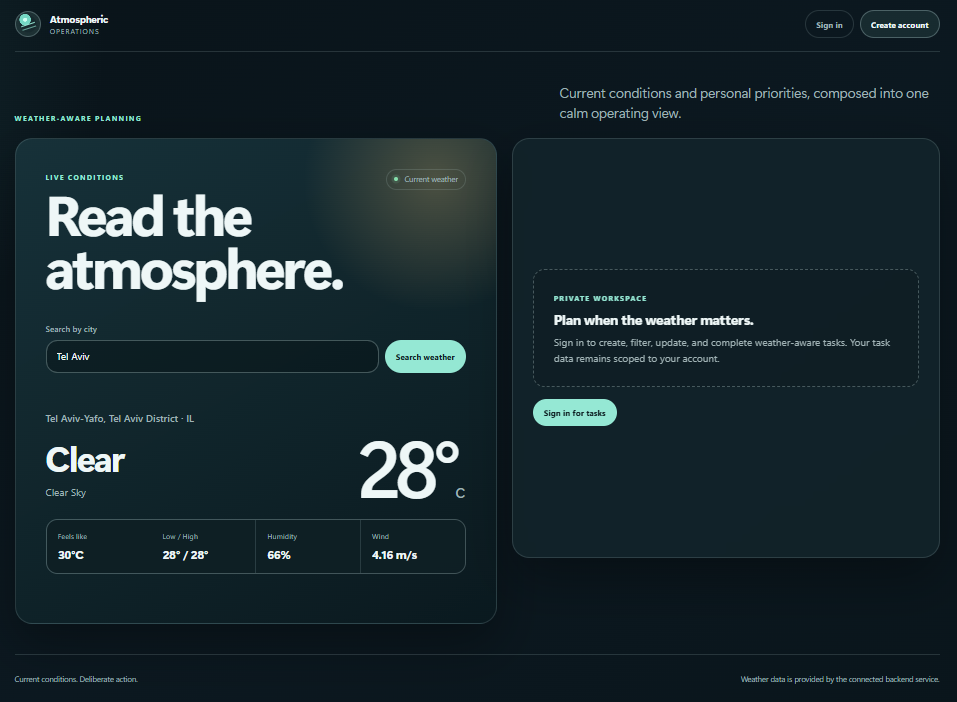

# Weather Information API

### Atmospheric Operations  Full-Stack Weather and Task Management Platform

Search current weather by city, then use an authenticated workspace to create and manage private weather-related tasks. The project demonstrates a complete full-stack architecture with authentication, PostgreSQL persistence, automated testing, OpenAPI documentation, and production deployment.

## Live Links

- [Live Application](https://weather-information-api-frontend.onrender.com)
- [Swagger API Documentation](https://weather-information-api-backend.onrender.com/api/docs)
- [Health Check](https://weather-information-api-backend.onrender.com/api/health)

## Project Preview

[](https://weather-information-api-frontend.onrender.com)

## Key Capabilities

- Look up current weather by city, including temperature, feels-like temperature, humidity, conditions, wind, and resolved location details.
- Register, sign in, restore a stored session, and log out with server-side token revocation.
- Create, edit, mark pending or complete, delete, and filter personal tasks by status and category.
- Isolate every authenticated task query and mutation to the task owner.
- Present responsive loading, empty, success, validation, authentication, and weather-provider error states.

## What This Project Demonstrates

- REST API design with an implementation-aligned OpenAPI 3.1 contract.
- Layered Express boundaries across routes, middleware, controllers, services, and Prisma data access.
- JWT bearer authentication with `jose`, bcrypt password hashing, authenticated identity retrieval, and database-backed token revocation.
- User-scoped authorization enforced within task database queries.
- OpenWeatherMap geocoding and current-weather integration.
- PostgreSQL persistence, Prisma migrations, and the Prisma PostgreSQL adapter.
- Centralized frontend API communication with bearer-token injection, session restoration, API error normalization, and task status mapping.
- Automated backend integration tests and frontend behavior tests.
- Render frontend and backend deployment with Neon PostgreSQL and environment-based CORS configuration.

## Production Architecture

```text
Browser
   -> React frontend on Render Static Site
   -> Express API on Render Web Service
      -> OpenWeatherMap
      -> Neon PostgreSQL through Prisma
```

The browser loads the React frontend from Render and communicates with the Express API. The backend handles authentication, weather, and task operations; OpenWeatherMap supplies weather data, while Neon PostgreSQL stores users, tasks, and revoked token identifiers.

[Architecture documentation](docs/architecture.md)

## Technology Stack

| Responsibility | Technologies |
| --- | --- |
| Frontend | React 19, Vite, TypeScript, native `fetch`, custom CSS |
| Backend | Node.js 24, Express 5, ES modules |
| Authentication | `jose`, JWT bearer tokens, bcrypt, database-backed revocation |
| Data | PostgreSQL, Prisma ORM, Prisma PostgreSQL adapter |
| External provider | OpenWeatherMap |
| API documentation | OpenAPI 3.1, Swagger UI |
| Testing | Vitest, Supertest, React Testing Library, MSW |
| Deployment | Render Static Site, Render Web Service, Neon PostgreSQL |

## Testing and Quality

The current test source contains 9 backend integration test cases and 18 frontend test cases covering authentication, authorization boundaries, task workflows, weather states, session behavior, and API error handling.

The project validation workflow also includes frontend linting, TypeScript checking, and production build validation.

## Quick Start

### Prerequisites

- Node.js 24 (`>=24.0.0 <25.0.0`)
- PostgreSQL
- OpenWeatherMap API key

### Backend

```bash
cd backend
npm install
npm run build
npx prisma migrate deploy
npm run dev
```

Copy `backend/.env.example` to `backend/.env`, provide local development values, and never commit the real file.

| Variable | Purpose |
| --- | --- |
| `PORT` | Local API port |
| `OPENWEATHER_API_KEY` | Server-side weather provider credential |
| `JWT_SECRET` | Access-token signing and verification secret |
| `DATABASE_URL` | Runtime PostgreSQL connection |
| `DIRECT_URL` | Direct PostgreSQL migration connection |
| `CORS_ORIGINS` | Comma-separated allowed browser origins |
| `TEST_DATABASE_URL` | Isolated backend test database |
| `SHADOW_DATABASE_URL` | Prisma shadow database |

### Frontend

```bash
cd frontend
npm install
npm run dev
```

Copy `frontend/.env.example` to `frontend/.env` only when an API-base override is needed. `VITE_API_BASE_URL` defaults to `/api`, and local Vite development proxies `/api` to `http://localhost:3000`.

## Validation

Backend:

```bash
cd backend
npm test
```

Frontend:

```bash
cd frontend
npm run lint
npm run typecheck
npm test
npm run build
```

## Technical Documentation

- [Architecture](docs/architecture.md)
- [Deployment](docs/deployment.md)
- [OpenAPI source](backend/openapi.yaml)
- [Live Swagger UI](https://weather-information-api-backend.onrender.com/api/docs)
- [Live health endpoint](https://weather-information-api-backend.onrender.com/api/health)

Swagger UI and `backend/openapi.yaml` are the source of truth for endpoint-level request and response contracts.
