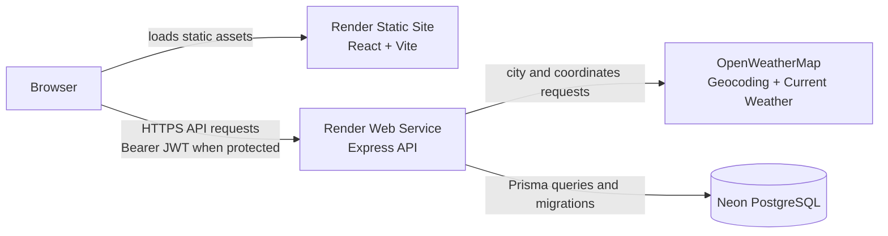

# Architecture

## System Context

Atmospheric Operations separates presentation, API behavior, external weather access, and persistence:

- A React, Vite, and TypeScript application is deployed as a Render Static Site.
- A Node.js and Express API is deployed as a Render Web Service.
- OpenWeatherMap supplies geocoding and current-weather data.
- Neon PostgreSQL stores users, tasks, and revoked token identifiers through Prisma.

The static site serves browser assets; browser API requests go directly to the backend URL configured by `VITE_API_BASE_URL`. The backend permits browser requests only when their origin is present in `CORS_ORIGINS`.

## Frontend Responsibilities

The frontend provides public weather search and an authenticated task workspace. It owns presentation state, form validation, responsive behavior, and user-facing loading, empty, success, authentication, validation, and server-error states.

Transport concerns are centralized:

- `src/api/client.ts` resolves `VITE_API_BASE_URL`, serializes JSON, attaches bearer tokens to protected requests, parses responses, and normalizes authentication failures.
- `src/api/session.ts` stores only the access token in browser local storage.
- Feature-specific API modules define authentication, weather, and task requests.
- `AuthProvider` restores a stored session through `GET /api/auth/me`, exposes authenticated user state, and clears local session data after protected `401` responses or logout.
- Task response statuses (`PENDING` and `CHECKED`) are mapped to lowercase request values in the API layer rather than UI components.

## Backend Layering

The Express application follows a layered request path:

1. **Routes** define methods and paths for authentication, weather, and tasks.
2. **Authentication middleware** verifies bearer tokens for protected routes and resolves the current user.
3. **Controllers** validate HTTP input and shape HTTP responses.
4. **Services** implement authentication, weather-provider, and task operations.
5. **Prisma data access** reads and writes PostgreSQL records.

Global middleware configures JSON parsing, an environment-based CORS allowlist, error responses, the health endpoint, and Swagger UI. Endpoint request and response details remain in [OpenAPI](../backend/openapi.yaml).

## Authentication and Session Flow

Registration normalizes the email address, hashes the password with bcrypt, and stores only the password hash. Login compares the supplied password and returns an HS256 JWT containing:

- the user ID as the subject;
- a unique token identifier (`jti`);
- the user's email;
- issue and one-hour expiration timestamps.

For each protected request, the authentication middleware:

1. Extracts the bearer token.
2. Verifies its signature, HS256 algorithm, subject, token identifier, and expiration.
3. Checks the `RevokedToken` table for the token identifier.
4. Loads the user from PostgreSQL.
5. Attaches the verified user and token metadata to the request.

`GET /api/auth/me` returns the authenticated identity used for frontend session restoration. Logout writes the active token identifier and expiration to `RevokedToken`; later use of that token returns `401`.

## Task Ownership Isolation

All task routes require authentication. Ownership is enforced in the service-layer database predicates:

- Lists always filter by `userId`.
- Single-task reads filter by both task ID and `userId`.
- Updates use `updateMany` with both identifiers.
- Deletes use `deleteMany` with both identifiers.

A task that does not exist and a task owned by another user both produce the same not-found result. Integration tests cover cross-user list, read, update, and delete isolation.

## Weather Integration

Weather search is public. The backend:

1. Validates and trims the city query.
2. Calls the OpenWeatherMap geocoding API for the first matching location.
3. Calls the current-weather API with the resolved coordinates and metric units.
4. Maps provider data into the stable API response documented by OpenAPI.

Missing cities return `404`; upstream geocoding or weather failures return `502`. The OpenWeatherMap API key remains server-side.

## Persistence

Prisma maps three PostgreSQL models:

- `User` for normalized credentials and account timestamps.
- `Task` for user-owned planning data and pending/checked status.
- `RevokedToken` for invalidated JWT identifiers and expiration timestamps.

Tasks and revoked tokens reference their owning user with cascade deletion. The runtime Prisma adapter connects through `DATABASE_URL`; Prisma migration tooling uses `DIRECT_URL`.

## Boundaries and Limitations

- Weather availability and accuracy depend on OpenWeatherMap.
- The application provides current conditions, not forecasts or historical weather.
- Access tokens are browser-held bearer credentials stored in local storage; the implementation does not use cookie sessions.
- Logout revokes the presented token, not every token previously issued to the user.
- The repository does not contain an automated cleanup job for expired revocation records.
- CORS is an origin allowlist, not an authentication mechanism; protected operations still require a valid bearer token.
- Render and Neon service settings are configured outside this repository because no deployment infrastructure file is tracked.
